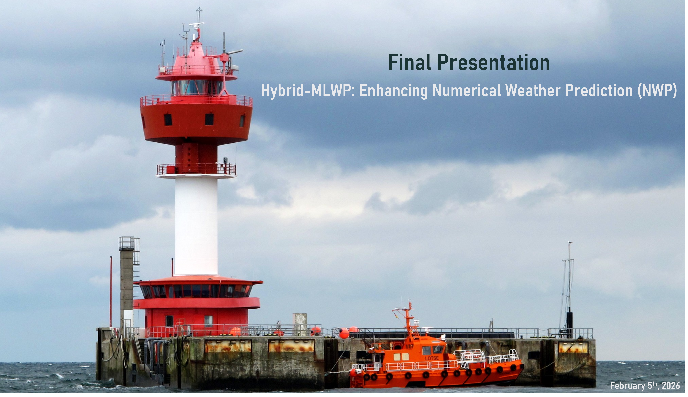

# [Hybrid-MLWP: Enhancing Numerical Weather Prediction (NWP)]

## Repository Link

[[https://github.com/your_username/your_project_name](https://github.com/carlschmidt26/Hybrid-MLWP-Enhancing-Numerical-Weather-Prediction-NWP-)]

## Description

This project investigates the potential of the self-attention mechanism in enhancing Numerical Weather Predition (NWP) by means of Machine Learning in so-called Machine Learning-based Weather Prediction (MLWP).
To this end, a number of experiments are conducted to assess the effect of different hyperparameters or model design configurations.

### Task Type

Eventually, the goal is to develop an approach to improve the forecast produced by a common NWP model to match the actually observed value. 
Due to the absense of observational data, the dataset [NCEP GFS 0.25 Degree Global Forecast Grids Historical Archive](https://gdex.ucar.edu/datasets/d084001/) from the Global Forcasting System (GFS) has been used and interpolated to hourly resolution at Kiel Lighthouse ()].
The task type is therefore framed as a supervised autoregressive regression problem.

### Results Summary

#### Best Model Performance
- **Best Model:** TBD
- **Evaluation Metric:** TBD
- **Final Performance:** TBD

> [!IMPORTANT]
> Due to constraints in the current implementation of the `WeatherModelDataset(Dataset)` and the `WeatherModelDataModule(LightningDataModule)`, their coupling, the handling of NaN values and the batching operations will be subject to refactoring to also enable cross-validation of the different experiment.
> More importantly, the current implementation likely suffers from temporal leakage, due to a possible overlap of the trailing data points from the training data into the first data points of the validation data. This issue will be adressed alongside with the implementation **Experiment A**, as, in contrast to a value forecast, using a delta forecast and regularizing predictions where ($\Delta = 0$) () might be necessary to prevent the model from learning to predict a persistent value (→ see **[Baseline Model](2_BaselineModel/baseline_model.ipynb)**). Avoiding persistence could therefore be an equally critical prerequisite for all subsequent experiments. Detailed evaluation of the models has therefore been postponed until these issues are resolved.

#### Model Comparison
- **Baseline Performance:** 
- **Improvement Over Baseline:** TBD
- **Best Alternative Model:** TBD

#### Key Insights
- **Most Important Features:** The model's performance is heavily driven by the *zonal wind component* and *mean sea level pressure*, alongside cyclical temporal encodings that capture diurnal patterns.
- **Model Strengths:** The Transformer architecture shows a high capacity for reducing initial loss quickly and successfully capturing the high autocorrelation present in the hourly interpolated GFS data.
- **Model Limitations:** The current setup is prone to "Persistence Learning," where the model minimizes loss by echoing the most recent input token rather than modeling atmospheric dynamics.
- **Project Impact:** Establishing a robust "Residual Learning" framework is identified as the critical next step to move beyond simple persistence and achieve true predictive skill in a hybrid NWP-MLWP context.

## Documentation

1. **[Literature Review](0_LiteratureReview/README.md)**
2. **[Dataset Characteristics](1_DatasetCharacteristics/exploratory_data_analysis.ipynb)**
3. **[Baseline Model](2_BaselineModel/baseline_model.ipynb)**
4. **[Model Definition and Evaluation](3_Model/model_definition_evaluation)**
5. **[Presentation](4_Presentation/README.md)**

## Cover Image

